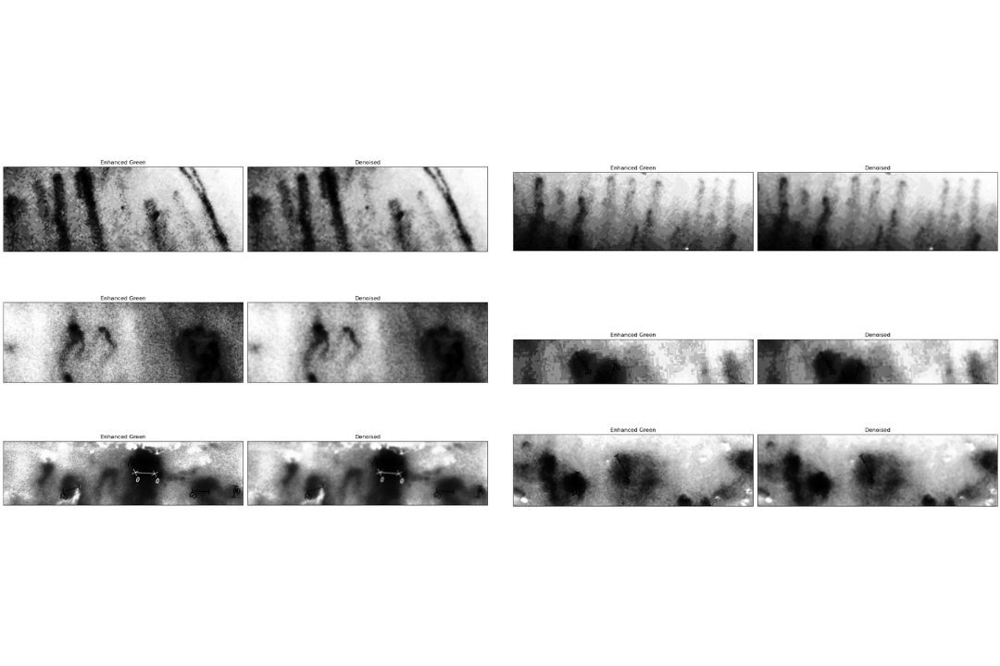

# Capillary Segmentation in Nailfold Capillaroscopy Images

 

Traditional image processing pipeline for detecting and segmenting capillaries in nailfold capillaroscopy images using classical computer vision techniques.

## Table of Contents
- [Overview](#overview)
- [Methodology](#methodology)
- [Pipeline Architecture](#pipeline-architecture)
- [Installation](#installation)
- [Usage](#usage)
- [Results](#results)
- [Discussion](#discussion)
- [Future Work](#future-work)
- [References](#references)
- [License](#license)

## Overview
This project implements an image processing pipeline for analyzing nailfold capillaroscopy images, which are used to study microvascular structures. The method detects reference lines, isolates regions of interest, enhances capillary visibility, and segments capillaries using adaptive thresholding and contour detection.

## Methodology
The processing pipeline consists of sequential stages:
1. Line detection using Probabilistic Hough Transform
2. Image cropping and rotation based on detected lines
3. RGB channel separation and green channel enhancement
4. Contrast enhancement and noise reduction
5. Capillary segmentation via adaptive thresholding
6. Contour detection and capillary counting

## Pipeline Architecture
### Figure 2: Workflow Diagram
 

## Installation
### Dependencies
- Python 3.8+
- OpenCV
- NumPy
- Matplotlib
- scikit-image

### Setup
```bash
pip install opencv-python numpy matplotlib scikit-image
```

## Usage
1. Place nailfold capillaroscopy images in `Input Images/` directory
2. Run main processing notebook:
```python
main.ipynb
```

### Key Parameters
```python
# In find_line()
threshold=25       # Hough transform threshold
minLineLength=100  # Minimum line length
maxLineGap=65      # Max gap between line segments

# In crop_image()
margin=110          # Cropping margin
space_below_line=-2 # Vertical adjustment
```

## Results

### Figure 3: Test Data with Accurate Results


### Figure 4: Test Data with Almost Accurate Results


### Figure 5: Test Data with Inaccurate Results


## Figure 6: Test data masked with the detected line


### Figure 7: Line Detection Results


### Figure 8: Cropping and Rotation Results


### Figure 9: Enhanced and Denoised Images


### Performance Comparison
| Image       | Detected | Ground Truth | Accuracy |
|-------------|----------|--------------|----------|
| N1b         | 7        | 7            | 100%     |
| N2b         | 8        | 8            | 100%     |
| N2c         | 10       | 10           | 100%     |
| S2d         | 14       | 5            | 36%      |
| S3h         | 5        | 4            | 80%      |

## Discussion
### Strengths
- Accurate line detection in all test cases
- Effective green channel enhancement
- Computationally efficient processing
- No training data required

### Limitations
- Sensitive to parameter tuning
- Struggles with overlapping capillaries
- No capillary shape priors used
- Requires expert validation for clinical use

> "The contouring algorithm lacks explicit capillary definition, potentially identifying noise as capillaries" - Project Report

## Future Work
1. Incorporate deep learning for capillary recognition
2. Develop automatic parameter tuning
3. Add 3D capillary reconstruction
4. Implement capillary morphology analysis
5. Create expert validation interface

## References
1. Ruaro B. et al. - *Normalization methods for nailfold images* (Microvasc Res 2015)
2. Kurzinski K. & Torok KS. - *Digital microscopy applications* (Methods Mol Biol 2019)
3. Gonzalez R. C. & Woods R. E. - *Digital Image Processing* (Prentice Hall)
4. Otsu N. - *Threshold selection method* (IEEE Trans. Sys. Man Cyber. 1979)

## License
[MIT License](LICENSE.md)